# Entity Model

> This document describes the **target relational schema** (see `docs/superpowers/specs/2026-09-04-saas-database-design.md` and `db/src/main/resources/db/migration/`). It replaces the earlier version of this file, which documented the legacy single-clinic `app_data (key, value jsonb)` key/value store. That legacy shape is preserved for reference in git history and in the business rules cross-references below.
>
> Every table except the platform tables (`clinic`, `app_user`, `role`, `permission`, `role_permission`) carries `clinic_id` and is tenant-isolated by PostgreSQL Row-Level Security. Column-level detail (types, lengths, constraints) lives in `docs/data_dictionary.md`; this file covers relationships and rationale.

## Entity Relationship Diagram

```mermaid
erDiagram
    CLINIC ||--o{ MEMBERSHIP : "has members"
    APP_USER ||--o{ MEMBERSHIP : "belongs via"
    ROLE ||--o{ MEMBERSHIP : "grants"
    ROLE ||--o{ ROLE_PERMISSION : "has"
    PERMISSION ||--o{ ROLE_PERMISSION : "granted by"
    MEMBERSHIP ||--o{ MEMBERSHIP_PERMISSION : "overrides"
    MEMBERSHIP ||--o| EMPLOYEE : "may be linked to"

    CLINIC ||--o{ EMPLOYEE : "employs"
    EMPLOYEE ||--o{ DAILY_RECORD : "logs"
    EMPLOYEE ||--o{ SELF_CHECK : "checks in via"
    EMPLOYEE ||--o{ TASK_ASSIGNMENT : "is assigned"
    EMPLOYEE ||--o{ EVALUATION_SNAPSHOT : "has frozen"
    EMPLOYEE ||--o{ PERFORMANCE_OVERRIDE : "has manual"
    EMPLOYEE ||--o{ ACADEMY_STEP_SUBMISSION : "trains through"
    EMPLOYEE ||--o{ ACADEMY_EXAM_ATTEMPT : "attempts"
    DAILY_RECORD ||--o{ DAILY_TASK_COMPLETION : "marks"
    DAILY_TASK_COMPLETION }o--|| TASK_DEFINITION : "for"
    EVALUATION_SNAPSHOT ||--o{ EVALUATION_COMPONENT : "breaks down into"

    ACADEMY_UNIT ||--o{ ACADEMY_QUESTION : "has exam"
    ACADEMY_UNIT ||--o{ ACADEMY_STEP_SUBMISSION : "verified by"

    PREP_CHECKLIST ||--o{ PREP_SECTION : "has"
    PREP_SECTION ||--o{ PREP_ITEM : "has"
    PREP_CHECKLIST ||--o{ PREP_RUN : "run as"
    PREP_RUN ||--o{ PREP_RUN_ITEM : "checks off"
    PREP_ITEM ||--o{ PREP_RUN_ITEM : "checked in"

    SUPPLIER ||--o{ INVENTORY_ITEM : "preferred by"
    SUPPLIER ||--o{ PURCHASE_ORDER : "fulfills"
    SUPPLIER ||--o{ SUPPLIER_RETURN : "receives"
    INVENTORY_ITEM ||--o{ STOCK_MOVEMENT : "moves"
    STOCK_LOCATION ||--o{ STOCK_MOVEMENT : "at"
    PURCHASE_ORDER ||--o{ PURCHASE_ORDER_LINE : "has"
    PURCHASE_ORDER_LINE ||--o{ SUPPLIER_RETURN_LINE : "returned via"
    SUPPLIER_RETURN ||--o{ SUPPLIER_RETURN_LINE : "has"
    INVENTORY_ITEM ||--o{ INVENTORY_CHANGE_REQUEST : "changed via"

    PROCEDURE ||--o{ PROCEDURE_BOM : "requires"
    INVENTORY_ITEM ||--o{ PROCEDURE_BOM : "consumed by"
    PROCEDURE ||--o{ PROCEDURE_CASE : "billed as"
    EMPLOYEE ||--o{ PROCEDURE_CASE : "issues items for"
    PROCEDURE_CASE ||--o{ PROCEDURE_CASE_ITEM : "issues"
    INVENTORY_ITEM ||--o{ PROCEDURE_CASE_ITEM : "issued as"
```

## Section index

Full column-level detail for every table below is in `docs/data_dictionary.md`.

### 1. Tenancy & identity

`clinic`, `app_user`, `membership`, `role`, `permission`, `role_permission`, `membership_permission`.

Replaces the legacy `config.users` list and the `owner`/`invRole` fields. Login (`app_user`) is separated from clinic authorization (`membership`) so one person can staff several clinics. `membership_permission` centralizes the per-user section visibility the legacy app scattered across every module (BR-G02, BR-G03, BR-G25, BR-G30).

### 2. Clinic configuration

`clinic_settings`, `evaluation_weight`, `incentive_tier`.

Replaces the legacy `config` blob's shift defaults, evaluation weights (BR-G14), and incentive tiers (BR-G07) — now per-clinic rows instead of hardcoded JS constants.

### 3. Staff & daily work

`employee`, `task_definition`, `daily_record`, `daily_task_completion`, `self_check`, `task_assignment`.

Replaces `config.employees`, `config.tasks.<role>`, `daily:<empId>:<date>`, `selfcheck:<empId>:<date>`, `assign:<empId>` (BR-G04, BR-G08–BR-G13).

### 4. Evaluation

`performance_override`, `evaluation_snapshot`, `evaluation_component`, `operations_volume`.

Replaces `override:<empId>:<month>`, `evalSnap:<empId>:<month>`, `invoice:<month>`. `evaluation_snapshot` immutability (BR-G05) is enforced by a database trigger (`db/.../V10__triggers.sql`), not application discipline. `evaluation_component.included` implements the no-data-category exclusion rule (BR-G15).

### 5. Academy

`academy_unit`, `academy_question`, `academy_step_submission`, `academy_exam_attempt`.

Replaces `config.academy`, `EMPLOYEE.onboard`, `acadimg:`. Certificate eligibility (BR-G24) is derived from the latest passing `academy_exam_attempt` row rather than stored.

### 6. Prep checklists

`prep_checklist`, `prep_section`, `prep_item`, `prep_run`, `prep_run_item`.

Replaces `prep:list`, `prepRun:`. Non-empty-checklist (BR-G19) is a service-layer check at approval time — not expressible as a table constraint.

### 7. Inventory

`supplier`, `inventory_item`, `stock_location`, `stock_alert_threshold`, `stock_movement`, `purchase_order`, `purchase_order_line`, `supplier_return`, `supplier_return_line`, `inventory_change_request`.

Replaces the single `inv:state` blob (`items`, `sups`, `orders`, `received`, `returns`, `invQueue`). On-hand quantity is the sum of `stock_movement.qty_delta` per `(item, location)` — an append-only ledger instead of a mutated counter. The return-quantity ceiling (BR-G27) and the approval queue (BR-G26) are now real constraints/tables instead of JS-checked array entries.

### 8. Procedures & costing

`procedure`, `procedure_bom`, `procedure_case`, `procedure_case_item`.

Replaces the `inv:state` blob's `procs` list and case records from UC-008. `procedure_case.patient_ref` is deliberately an opaque clinic-side code, never a patient name — keeping a staff-performance product out of health-record regulatory scope.

### 9. Cross-cutting

`attachment`, `activity_log`, `notification`.

Replaces inline image blobs (e.g. `acadimg:`) with object-storage pointers, and `log:<date>` with a proper indexed audit table.

## What changed structurally vs. the legacy blob model

- **Tenancy added throughout** — every table above (except the 5 platform tables) carries `clinic_id`, enforced by Postgres RLS.
- **Inventory decomposed** from one contended JSON row into 10 normalized tables with an append-only stock ledger.
- **Authorization centralized** into `role`/`permission`/`membership_permission` instead of one `owner` boolean plus scattered per-module flags.
- **Frozen-month immutability and the return-quantity ceiling are database-enforced**, not just JS-enforced.
- **Deliberately not centralized**: task/checklist/inventory approval stayed as three separate mechanisms (status columns vs. a change-request table) rather than one polymorphic "approval" abstraction — see the spec's rationale.
